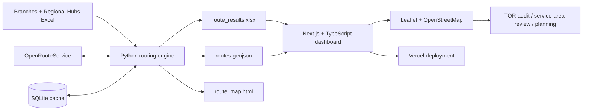
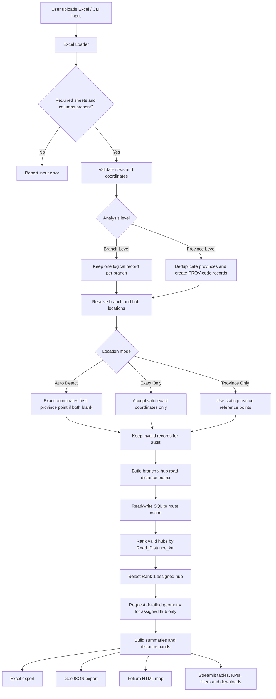
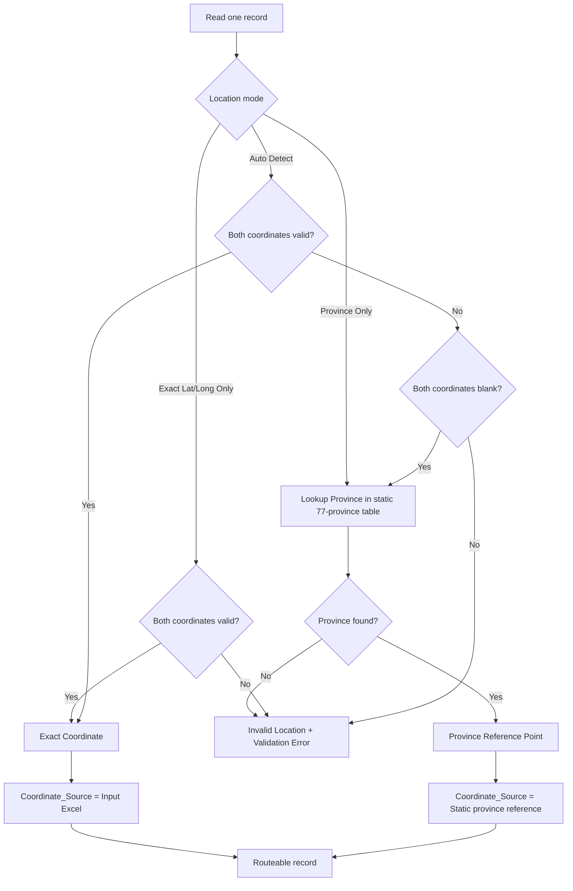
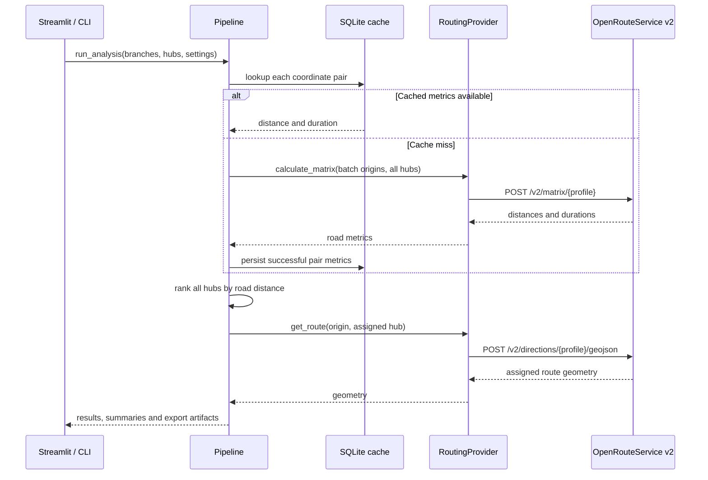
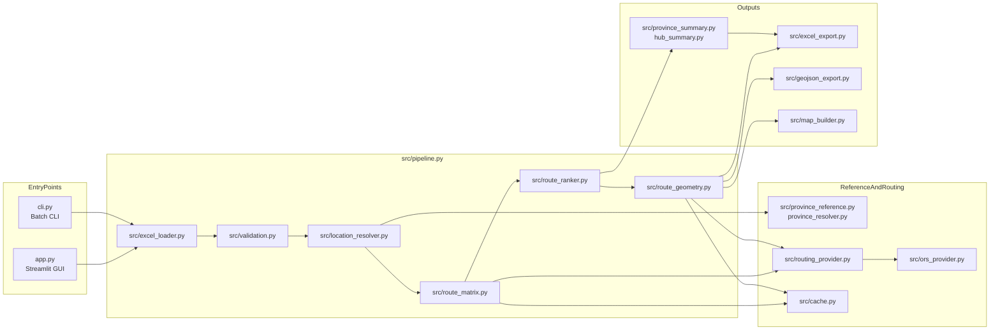
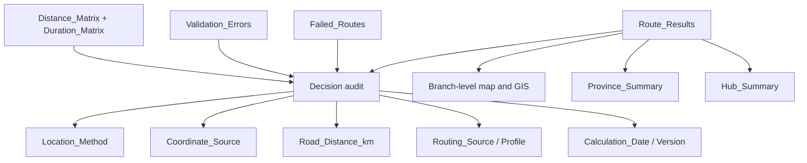

# Architecture and Processing Flow

เอกสารนี้อธิบาย flow การทำงานและโครงสร้างของ Thailand Branch Routing Analysis ด้วย Mermaid โดยแผนภาพจะแสดงลำดับตั้งแต่รับ Excel จนถึง export ผลลัพธ์

## 0. Hybrid deployment overview

Python เป็น calculation and audit layer ส่วน TypeScript เป็น visualization layer จึงไม่ต้องย้าย ORS key, SQLite cache หรือ business rules ไปไว้ใน browser

## 1. End-to-end application flow

## 2. Location resolution decision

## 3. Routing and cache flow

## 4. Program structure

## 5. Output and audit model

## Design rules

1. `Road_Distance_km` from the routing provider is the assignment criterion; Haversine is a reference check only.
2. The number of hubs is discovered from input data; routing logic does not assume seven hubs.
3. Matrix routing is batched and cached. Detailed route geometry is requested only after Rank 1 is known.
4. Invalid rows are retained in outputs and reported in `Validation_Errors`; one failed route does not stop the complete run.
5. Province coordinates come from the static UTF-8 `data/thailand_provinces.csv` file so calculations remain reproducible.
